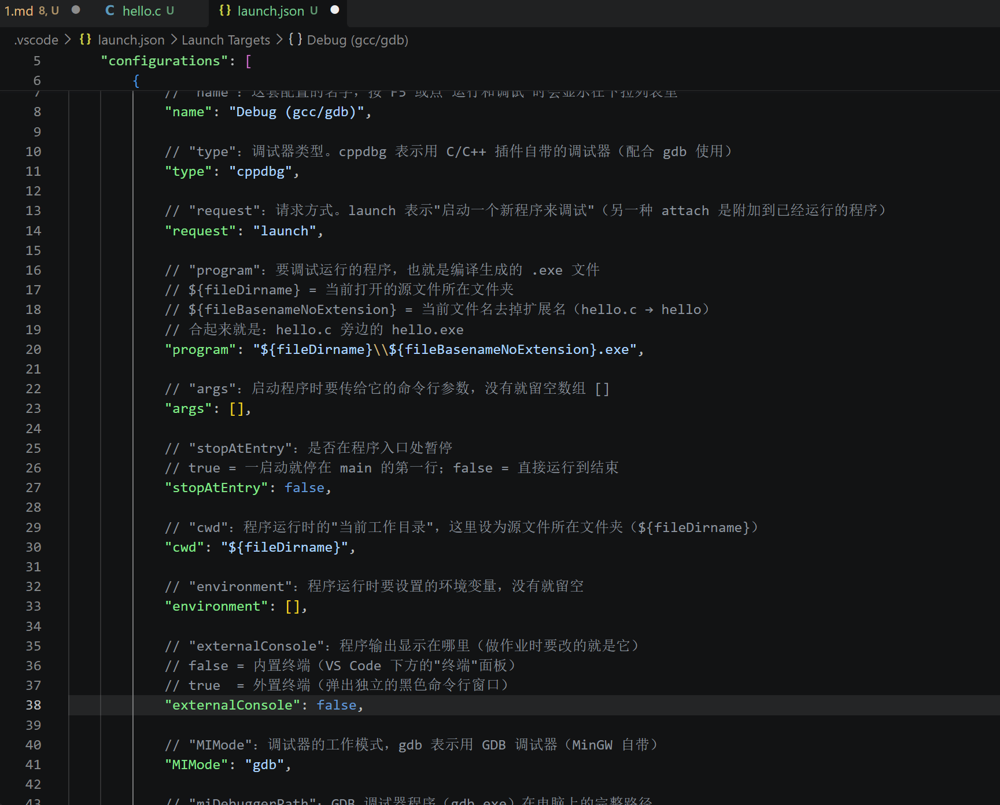
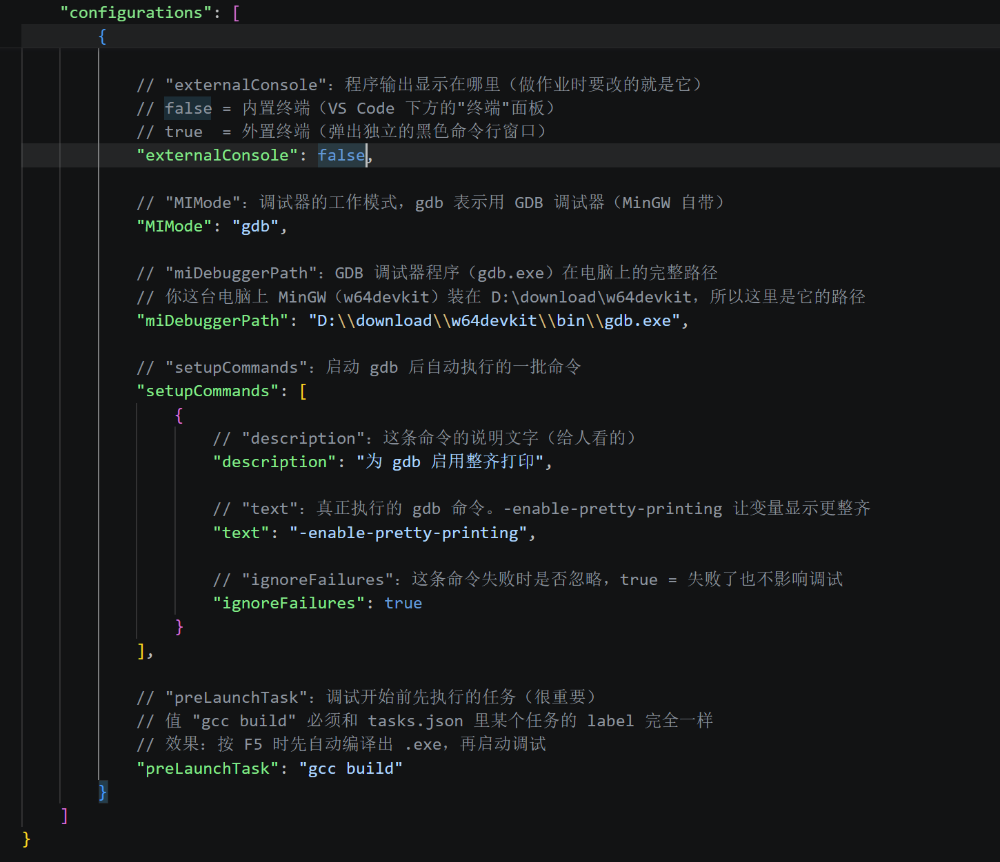
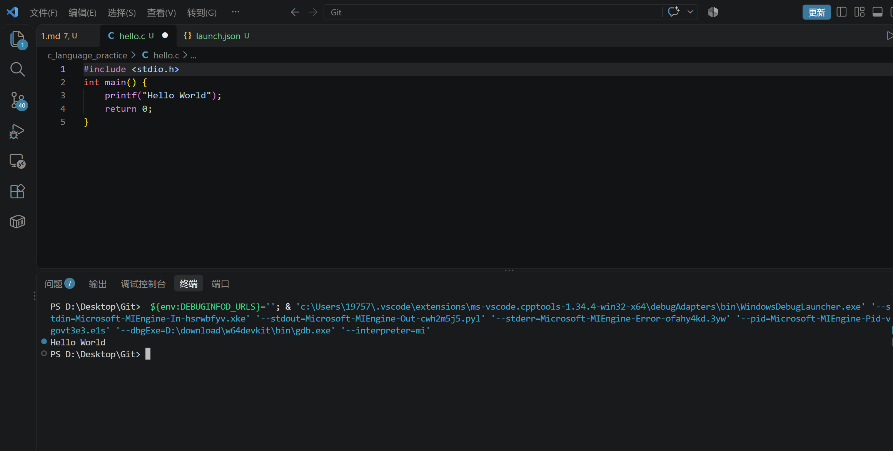

# C-EASY-1：C语言入门

## part1_了解C语言配置文件

### 1：什么是 GCC？什么是 MinGW？它们的作用是什么？

- GCC 是一个编译器,把代码翻译成电脑上的可执行程序。
- MinGW 是 GCC 在 Windows 系统上的安装包。MinGW 把 GCC 从 Linux 系统移植到了 Windows 上，我们装了 MinGW，就能在 Windows 里使用 GCC 了。


### 2：c_cpp_properties.json、tasks.json、launch.json 这三个文件分别有什么作用？  

这三个文件都是 VS Code 的配置文件（JSON 是一种给程序读取的文本格式），放在项目文件夹里的 .vscode 目录中。它们的作用如下：

- c_cpp_properties.json：（编辑）

- 告诉编辑器编译器装在哪里、头文件在哪里、用哪个 C 语言标准  

  

- tasks.json：（编译）

- 配置 "一键编译" 要执行的命令，调用 gcc 把 .c 文件编译成 .exe 文件

  

- launch.json：（调试）

- 配置调试器怎么启动、要调试哪个程序


### 3：为什么要在编辑器里下载 C 语言的插件？插件的作用是什么？

VS Code 本身只是一个 "通用文本编辑器"，C 语言插件帮助VS Code识别C 语言

插件的作用有：语法高亮、智能补全、错误提示、集成编译调试(配合配置文件，可以在编辑器里一键编译、运行和调试程序)。

### 关于aunch.json中的配置:

- externalConsole: false 时，"hello world"输出在内置终端;(vs code里)

- externalConsole: true 时，"hello world"输出在外置终端。(弹出了一个的独立黑色命令行窗口，但是我不知道为什么它闪了一下就消失了，截不了屏)

  





## part2_C语言基础

### 1、变量类型

- 什么是变量的类型？

- 变量类型是用来告诉程序"这个变量里装的是哪种数据"的。它可以决定装的变量的内容、内存和运算法则。

  

- 为什么它重要？

- 只有变量类型选对了，程序才能按你想要的方式存储和计算；选错了，轻则结果不对，重则程序崩溃。所以变量的类型**很重要**。

  

- 存放年龄 18，应该选哪种基本变量类型？

- 选 int。因为年龄是整数，不会出现小数的浮点。

  

- 用一个 char 类型的变量存放 "apple" 可以吗？

- **不可以。** char 类型只能存放**一个**字符，比如 'a'、'b'、'c'。"apple" 是 5 个字符组成的一串文字（即字符串），一个 char 变量放不下。

- 正确的存储方式是用5个 **char **。(放在一个char[]字符串里)


### 2、数组的起始与边界

- 数组的第一个元素下标从 0 还是 1 开始？

- **从 0 开始。** 比如说对于 `int arr[5];` 来说，5 个元素的下标是 0、1、2、3、4，最后一个元素的下标是 4（长度减 1）。

  

- 访问越界（arr[5] 或 arr[-1]）会导致什么问题？

- 这种越界的访问表示去访问"不属于这个数组"的内存位置，会出现：包括但不限于读到垃圾值、影响其他程序的数据等等问题。

  

- 为什么数组越界是常见又危险的错误？

- 常见：调取数组里数据的时候，“[]”里的数字不是“第几位”数据的意思，而是距离数组首位有几个单位长度的意思，很容易搞错。

- 危险：不报错，难排查，易使程序崩溃，数据被破坏。

### 3、流程控制 - 循环结构

- 循环结构如何控制代码块重复执行？
- 循环就是让一段代码**反复执行**，直到条件不满足。

**for循环的基本结构：**

for (初始化; 条件判断; 迭代部分)
 {
    循环体；
}

各部分的作用：

**初始化**：只在循环开始前执行一次，通常给循环变量设初值。
**条件判断**：每次进入循环前检查，为真就执行循环体，为假就结束循环。
**迭代部分**：每次执行完循环体后运行，通常用来更新循环变量。


- while 和 do...while 在首次执行判断上的关键区别？

- **while**：**先判断、后执行**。条件一开始就不成立的话，循环体一次都不执行。
- **do...while**：**先执行、后判断**。不管条件成不成立，循环体**至少执行一次**。

对于“实现"计算 1 到 10 的和"”这个任务：
异同体会：for 把"初始化、判断、迭代"集中写在头部，适合**循环次数明确**的情况；while 把初始化放在外面，适合**不确定条件什么时候满足**的情况。两中方式做的事完全一样，区别只是写法不同。

### 4、流程控制 - 逻辑表达式

- 逻辑表达式和算术表达式的本质区别？

 从**运算对象**看：

算术表达式（a + b * c）的运算对象是**数值**，做的是数学运算；
逻辑表达式（age > 18 && score >= 60）的运算对象是**条件判断**（比较的结果），做的是"把多个条件组合成最终的判断"。

从**运算结果**看：

算术表达式的结果是**一个数值**；
逻辑表达式的结果只有**真/假**两种（1 真，0 假）

- &&、||、! 的含义？

**&&（与）**：两边都为真，结果才为真；只要一边是假，结果就是假。
**||（或）**：只要一边为真，结果就为真；两边都为假，结果才是假。
**!（非）**：取反。真变假，假变真。

### 修改：

#### 需求分析

1. 设置合适的变量存储输入的姓名与年龄 → `char name[];` 和 `int age;`
2. 利用变量以原格式打印姓名与年龄 → 用 printf 打印
3. 每次"读取输入 → 打印内容"结束后，记录次数，并询问是否继续 → `int count;` 计数 + 打印提示
4. 需要继续 → 重复前面的读取输入 → 打印操作 → 循环回去
5. 不需要继续 → 打印记录的次数，结束程序

#### 修改后的程序代码：*姓名录入*

```c
#include <stdio.h>

int main(void)
{
    char arrName[100];

    int age, choice = 1;

    int i = 0;  //i即为count
    while(choice == 1)
    {
        printf("请输入姓名和年龄，中间用空格隔开：\n");
        scanf("%s %d", arrName, &age);   //字符串本身的数组名就是地址，不用加取址符“&”。

        printf("姓名是：%s，年龄是：%d\n", arrName, age);

        printf("是否继续输入？继续请输入 1，结束请输入 0：\n");
        scanf("%d", &choice);

        i++;
    }

    printf("结束程序,一共进行了 %d 次操作。\n", i);

    return 0;
}
```

## part3_函数

### 基于自定义函数的精简：

```c
#include <stdio.h>

// 乘方函数(用于计算方差)
int square(int n)
{
    return n * n;
}

// 综合成绩函数：传入三项成绩，返回这个人的综合成绩
int calcZh(int a, int b, int c)   //calc即calculate
{
    int p = (a + b + c) / 3;
    int f = (square(p - a) + square(p - b) + square(p - c)) / 3;
    int zh = 3 * p - f / 3;
    return zh;
}

// 排序函数：传入三人的综合成绩，按从高到低打印
void sortZh(int zh1, int zh2, int zh3)
{
    if (zh1 >= zh2 && zh2 >= zh3)
    {
        printf("小明 > 小强 > 小林");
    } 
    else if (zh1 >= zh3 && zh3 >= zh2) 
    {
        printf("小明 > 小林 > 小强");
    } 
    else if (zh2 >= zh1 && zh1 >= zh3) 
    {
        printf("小强 > 小明 > 小林");
    } 
    else if (zh2 >= zh3 && zh3 >= zh1) 
    {
        printf("小强 > 小林 > 小明");
    } 
    else if (zh3 >= zh1 && zh1 >= zh2) 
    {
        printf("小林 > 小明 > 小强");
    } 
    else 
    { // 最后一种情况：zh3 >= zh2 && zh2 >= zh1
        printf("小林 > 小强 > 小明");
    }
}

//主程序：
int main(void)
{
    int x1, x2, x3;
    int y1, y2, y3;
    int z1, z2, z3;
    
    printf("请输入小明的三项成绩（顺序为A B C,以一个空格为间隔）：");
    scanf("%d %d %d", &x1, &x2, &x3);
    printf("请输入小强的三项成绩（顺序为A B C,以一个空格为间隔）：");
    scanf("%d %d %d", &y1, &y2, &y3);
    printf("请输入小林的三项成绩（顺序为A B C,以一个空格为间隔）：");
    scanf("%d %d %d", &z1, &z2, &z3);

    int zh1 = calcZh(x1, x2, x3);
    int zh2 = calcZh(y1, y2, y3);
    int zh3 = calcZh(z1, z2, z3);

    sortZh(zh1, zh2, zh3);

    return 0;
}
```

### 关于值传递和引用传递

#### 原函数:

```c
void swap(int a, int b){
  int temp = a;
  a = b;             //利用临时的中间变量来实现交换数据的效果。
  b = temp;
}

int main(){
  int a = 10;
  int b = 20;
  swap(a, b);
}//把该程序补充完整后，会发现 a、b 的值根本没有被交换。
```

对这个函数而言:main 里的两个变量并不会被交换。
调用 swap 时，实参只是把 "值" 复制了一份给形参，swap 函数里的 *a*、*b* 是两个独立的新变量（原变量的副本），swap 交换的也只是这两个副本，函数一结束副本(形参)就销毁了；main 里的变量(实参)却根本没动。
**即：只进行了值传递。**

#### 修改函数:用指针来传递地址

```c
#include <stdio.h>

void swap(int *a, int *b)
{
    int temp = *a;
    *a = *b;
    *b = temp;
}

int main()
{
    int a = 10;
    int b = 20;

    swap(&a, &b);              
    printf("a = %d, b = %d\n", a, b);

    return 0;
}
```
